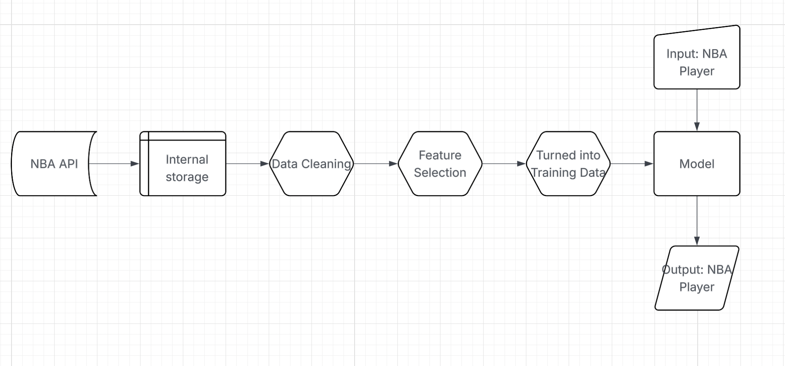

# Project Plan

## 1. Problem Framing

+ **Problem**: It is hard to objectively find similarities and comparisons between NBA players.

+ **Goal**: The goal is to design a program that uses nba data to objectively find the most similar player to a player inputted by the user.

+ **Non-ML Solution**: Use if statements and loops to find a player that has the most similar career stat line by iterating through the dataset whenever given an input. The similarities would be found through the closest numbers by difference.

+ **ML Solution**: Train a machine learning model on features selected through feature selection methods like Variance Threshold, K-Best Features, Recursive Feature Elimination, Boruta, etc. We will use a machine learning model that utilizes distance metric like Euclidean and Cosine Distance to find the most similar player.

+ **Why use Machine Learning to solve this problem?**: Efficiency is a major pro when it comes to using Machine Learning as a solution because it will provide is a model that could be used at anytime instead iterating through the large dataset in order to get an answer. Also, the machine learning model would be able to provide a more accurate answer as it distance metrics are much more precise and accurate that just find the difference in the player's stats.

## 2. Data Acquisition 

+ **Where will I get the Data?**: I will utilize [nba_api](https://github.com/swar/nba_api) and possibly kaggle dataset to find the data needed for this project. This API should have all the data we need to train this model

+ **How will I explore and manipulate this data**: I will use basic data science python libraries like pandas, numpy, and matplotlib to clean and manipulate the dataset in order to make it ready for it to train the model.

+ **Data Pipeline**: 

## 3. Project Deployment and Tech Stack

